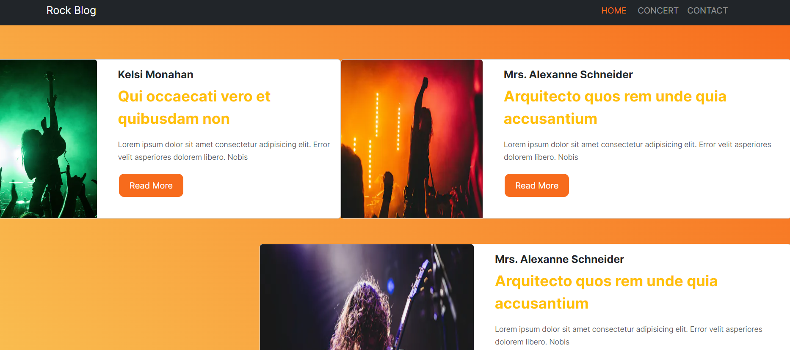
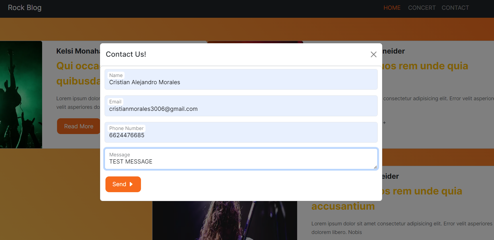

# Rock Blog

Rock Blog is a web application built with Next.js and styled using Bootstrap. It features a responsive design with a navbar, footer, and three main sections. The application allows users to send emails using the RESEND API.

## Features

- **Next.js**: Utilized for its powerful features such as server-side rendering and static site generation, which enhance performance and SEO.
- **Bootstrap**: Employed as the styling library to create a responsive and modern UI.
- **RESEND API**: Integrated for handling email sending functionality.

## Screenshots

### Home Page

The home page features a list of blog posts with a consistent layout and design.

### Contact Form

The contact form allows users to send messages via email. It includes fields for name, email, phone number, and message.

## Installation

To get started with the project, clone the repository and install the dependencies:

```bash
git clone https://github.com/Caml02/RockBlog.git
cd RockBlog
npm install
